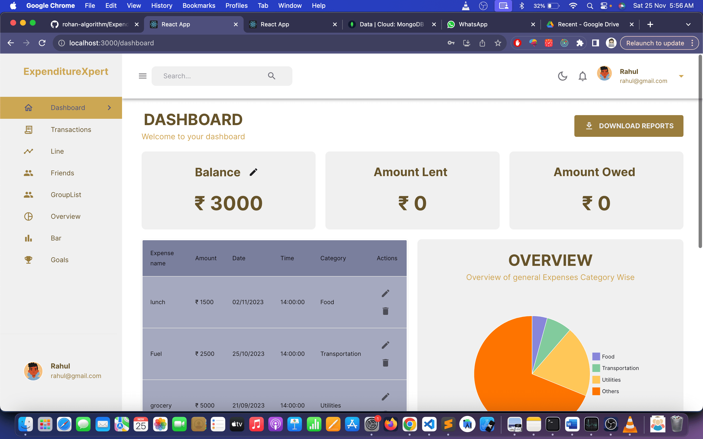
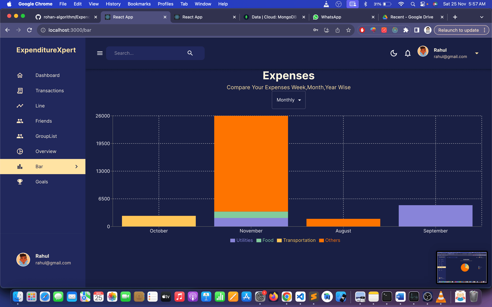
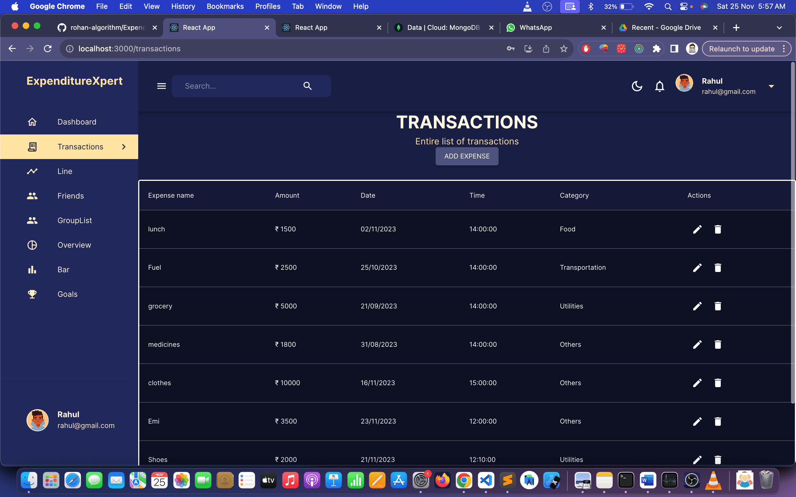

# ExpenditureXpert


## Description

ExpenditureXpert is an MERN Stack financial management app simplifies daily transactions, offering diverse expense categories for meticulous tracking. With an intuitive interface and multiple themes, users effortlessly visualize expenses. Timely notifications ensure no bill slips through the cracks, aiding savings goals. Social features enable friend addition, group creation, and seamless expense splitting, with reminders for pending dues. Transparent debt management within groups includes an approval system pre-settlement. Interactive charts provide insights into spending patterns on daily, weekly, monthly, and yearly bases. This app amalgamates user convenience, social connectivity, and insightful data representation for efficient personal finance and collaborative expense handling.

## Key Features

1. **Seamless Access:** Instant Login/Signup for quick entry.
2. **Transaction Recording:** Effortlessly log daily expenses.
3. **Expense Categories:** Categorize spending into food, shopping, and more.
4. **Visual Reports:** Intuitively visualize expense data for better insights.
5. **Custom Themes:** Dark Mode and diverse themes for personalized use.
6. **Bill Notifications:** Timely alerts for recurring bills and due transactions.
7. **Savings Tracking:** Monitor savings progress towards financial goals.
8. **Social Connectivity:** Add friends and create groups for shared expenses.
9. **Expense Splitting:** Easily split expenses within groups or with friends.
10. **Reminders:** Send reminders for pending dues and transactions.
11. **Debt Simplification:** Streamline group debts for transparency.
12. **Transaction Approval:** Seek approval before finalizing transactions.
13. **Data Visualization:** Analyze expenses through charts for various timeframes.

## Screenshots








## Installation

1. Clone the repository:

   ```bash
   git clone https://github.com/rohan-algorithm/ExpenditureXpert.git


Contact
If you have any questions or need assistance, feel free to contact us at rohanrao543211@gmail.com.   
